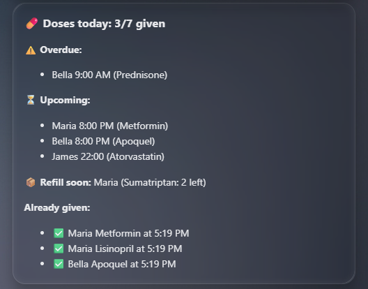
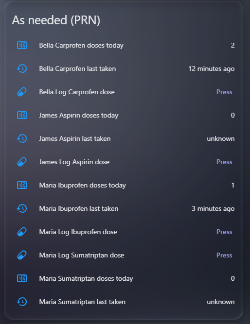
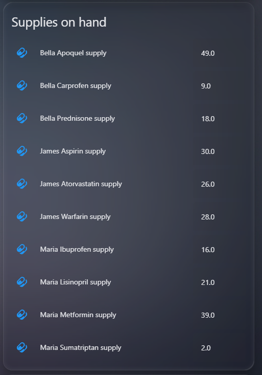

# 💊 Medication Reminder (Home Assistant integration)


[](https://my.home-assistant.io/redirect/hacs_repository/?owner=magikh0e&repository=ha-medication-reminder-hacs&category=integration)

A Home Assistant custom integration for tracking medication doses, for pets *and*
people. Add patients and their dose schedule **in the UI**; the integration
auto-creates a switch per dose (on = given today) and resets them daily. Pair it
with the included companion automations for actionable, nagging, missed-dose
reminders synced across every Companion app.

This is the UI-driven sibling of the YAML package at
[ha-medication-reminder](https://github.com/magikh0e/ha-medication-reminder).
Prefer pure YAML? Use that one. Want point-and-click dose management with
auto-created entities? Use this.


> ⚠️ **Alpha software.** This is new and not yet widely tested. Validate it on
> your own Home Assistant before relying on it, and keep a backup reminder method
> until you trust it. It is a reminder aid, **not** a medical device. Confirm
> dosing schedules with your doctor or vet.

**Jump to:** [Highlights](#highlights) · [Installation](#installation) · [Dashboard](#dashboard) · [Settings](#settings-per-patient) · [Supply & refill](#supply--refill-tracking) · [Safety](#safety--fail-safes) · [Roadmap](#roadmap)

## Highlights

- **Pets and people, all in the UI.** Add patients and their dose schedule from Settings, no YAML; entities auto-create per patient and survive restarts.
- **Flexible scheduling.** Each dose daily, on specific days of the week, every N days, an on/off cycle (e.g. 21 on / 7 off), specific days of the month, or as-needed (PRN, no reminders), in 12h or 24h.
- **As-needed (PRN) meds.** A "Log dose" button (and `log_dose` service) records each dose taken, with a last-taken timestamp, a doses-today count, and a supply decrement, so meds taken several times a day stay tracked.
- **Glanceable, fail-safe status.** A per-patient red/green "needs attention" sensor that trips on elapsed time alone and errs toward "problem"; wire it to a panel, light, or siren.
- **Actionable reminders.** Nagging, missed-dose escalation, and a "Mark given" button from the notification, routed to each patient's own notify target.
- **Supply & refill tracking.** Per-medication counts that decrement as doses are given, with doses-left, a run-out estimate, a low-stock red flag at your reorder threshold, and a refill reminder.
- **Next-dose sensor and calendar.** A `next_dose` timestamp and a read-only medication calendar per patient, handy for "remind me before" automations and seeing long cycles laid out.
- **Zero-edit dashboard.** Auto-discovers every patient and dose, no names to maintain.
- **Fail-safe by design.** Overdue detection trips on elapsed time alone and errs toward "problem", marking is reversible, dose state survives restarts, and every guard warns rather than blocks. See [Safety & fail-safes](#safety--fail-safes).

## Installation

### 1. Install the integration (HACS custom repository)

Use the **Open your Home Assistant instance** button at the top of this page to add the repo to HACS in one step, then install and restart, or do it manually:

1. HACS, top-right menu, **Custom repositories**.
2. Add `https://github.com/magikh0e/ha-medication-reminder-hacs` as an **Integration**.
3. Install **Medication Reminder**, then restart Home Assistant.

(Or copy `custom_components/medication_reminder/` into your HA `config/custom_components/` and restart.)

### Updating from an earlier version

Already running an older version? You keep all your patients, doses, schedules,
and supplies. You only need to update, and for the new early-dose warning, add
one automation.

1. **Update the integration:** in HACS, open **Medication Reminder**, use the
   three-dot menu, **Redownload**, choose the latest version, then **restart Home
   Assistant**. Your existing config is preserved.
2. **Core changes apply automatically** after the restart, including the
   `medication_reminder_dose_given` and `medication_reminder_dose_undone` events
   and supply-restore-on-undo (un-marking a dose puts its supply count back).
3. **For the early-dose warning (new in 0.10.0), add its automation** (see
   **3. Add the reminder automations** below). Import the
   [`early_dose.yaml`](blueprints/automation/medication_reminder/early_dose.yaml)
   blueprint, or if you use the pasted
   [`companion-automations.yaml`](companion-automations.yaml), re-paste the
   updated file. If you copy the YAML, **replace** your existing
   `medication_reminder_*` automations rather than adding a second copy, so
   reminders are not duplicated.
4. *(Optional)* **Switch from pasted YAML to blueprints.** Blueprints are new in
   0.10.0; to manage automations by one-click import and update, delete your old
   pasted automations and import the blueprints described below.

### 2. Add patients and doses

1. **Settings, Devices & Services, Add Integration, Medication Reminder.**
2. Enter the patient name (e.g. a pet or person), pick the **patient type** (Person / Dog / Cat / ..., which sets the icon), and the **notify target** (the person or group to remind). One patient per entry; add the integration again for more patients.
3. On the entry, click **Configure** to **Add a dose** (pick a time, type the medications, and choose the **schedule**: days of the week - all days = daily - or every N days, an on/off cycle, specific days of the month, or as-needed/PRN). Repeat for each dose. **Remove a dose** or open **Reminder settings** (type, notify target, time format, reset time, nag window/interval) there too.

Each dose appears as `switch.<patient>_<time>` with attributes `patient`,
`dose_time`, `medications`, and `notify_service`.

### 3. Add the reminder automations

The integration creates the entities; the reminders, nagging, missed-dose
escalation, refill reminders, and early-dose warning are driven by automations.
Pick one of two ways to add them:

**Blueprints (recommended), one-click import and easy updates.** In **Settings,
Automations & Scenes, Blueprints, Import Blueprint**, paste each URL you want,
then create an automation from it. To update later, re-import the blueprint (its
**three-dot menu, Re-import**) and the automations created from it pick up the
change automatically, with their inputs preserved. A HACS integration update
does **not** need a re-import; only re-import when a release note says a
blueprint itself changed.

- Reminders and missed-dose escalation (core):
  `https://github.com/magikh0e/ha-medication-reminder-hacs/blob/main/blueprints/automation/medication_reminder/medication_reminders.yaml`
- Mark given from notification (core, pairs with the above):
  `https://github.com/magikh0e/ha-medication-reminder-hacs/blob/main/blueprints/automation/medication_reminder/mark_given.yaml`
- Early-dose warning (optional):
  `https://github.com/magikh0e/ha-medication-reminder-hacs/blob/main/blueprints/automation/medication_reminder/early_dose.yaml`
- Low-supply refill reminder (optional):
  `https://github.com/magikh0e/ha-medication-reminder-hacs/blob/main/blueprints/automation/medication_reminder/low_supply.yaml`

**Or copy the YAML.** Paste the automations from
[`companion-automations.yaml`](companion-automations.yaml) into your
`automations.yaml` and reload; re-paste to update.

Each patient's reminders go to the **notify target you chose in the UI** (read
from the switch's `notify_service` attribute). The `default_notify` value in the
automation (`caretakers`) is only a fallback if a switch has no target set; if
you want a fallback group, define it, for example:
```yaml
notify:
  - platform: group
    name: caretakers
    services:
      - service: mobile_app_your_phone
```

They send a reminder when a dose is due and not given, nag every 15 minutes for
45 minutes, then escalate once as a time-sensitive "missed" alert. Tapping
**Mark given** turns the dose's switch on and clears the notification.

## Dashboard

A dashboard is optional, but the bundled [`lovelace-card.yaml`](lovelace-card.yaml)
is an auto-discovering, day-of-week-aware one that needs **no editing**: it finds
every patient and dose automatically, so adding, renaming, or removing a patient
just updates it.
Six parts:

1. a red/green status panel (from the `needs_attention` sensors),
2. a summary of **today's** scheduled doses (given / still to give, with times),
3. one combined "Mark given" card with every dose due today (tap to mark),
4. an "As needed (PRN)" card with a Log dose button per as-needed med and its "last taken" time,
5. one combined supplies card (units on hand, shown only if you track supplies),
6. a per-patient schedule overview (every dose, time, medications, and days).

It needs two HACS cards: [auto-entities](https://github.com/thomasloven/lovelace-auto-entities)
(the auto-discovering lists) and [card-mod](https://github.com/thomasloven/lovelace-card-mod)
(the pill icons are pinned blue so they stay out of the red/yellow/green status
colours; without card-mod the pills fall back to amber). Paste it as a manual
card, no names or entity_ids to change. The standalone status panel is below if
you only want that piece, and it needs no HACS cards at all.

For a wide area, [`lovelace-card-2col.yaml`](lovelace-card-2col.yaml) lays the
same cards out as a full-width status banner above two columns, sized to fill a
2-column-wide [Sections](https://www.home-assistant.io/dashboards/sections/)
view section: add a section, set its width to 2, and paste it as a manual card.


*The auto-discovering single-column layout ([`lovelace-card.yaml`](lovelace-card.yaml)); the wide two-column variant is described just above.*



*The today summary: doses given vs. still due, what is overdue or upcoming, and the times already-given doses were taken.*



*The As needed (PRN) card: a Log dose button per as-needed med, with its last-taken time and doses-today count.*

### Status panel (red/green, glanceable)

A simple "all OK / attention needed" panel for the top of a dashboard, driven by
the `needs_attention` sensors. Green when nothing is overdue, red (with who and
what) when something needs investigating. Native card, no HACS needed:


```yaml
type: markdown
content: |-
  
  
  
  # 🟢 All OK
  
  # 🔴 Attention needed
  
  - **{{ p.attributes.patient }}**: {{ p.attributes.overdue | join(', ') }}
  
  
```

Because `binary_sensor.<patient>_needs_attention` is a standard `problem` entity,
you can also drive a light, siren, pager, or notification straight off it.

**Make the panel flash when attention is needed** (needs the HACS
[card-mod](https://github.com/thomasloven/lovelace-card-mod) card). Add this to
the markdown card above:

```yaml
card_mod:
  style: |
    ha-card {
      
      animation: mr-flash 1.2s ease-in-out infinite;
      
    }
    @keyframes mr-flash {
      0%, 100% { background-color: var(--card-background-color); }
      50% { background-color: rgba(244, 67, 54, 0.55); }
    }
```

For care settings, a **physical** flash is even better: trigger a lamp or siren
off the `needs_attention` sensor so the alert is visible from across the room.

### Schedule overview

A card that lists each patient's full schedule (every dose, time, medications,
and which days it applies), not just today. Auto-discovers all patients, respects
each one's 12h/24h setting, and shows "Daily" or the specific days. Native
markdown card, no HACS needed:


```yaml
type: markdown
content: |-
  ## 📋 Medication schedule
  
  
  
  
  
  
  ### {{ {'dog':'🐕','cat':'🐈','person':'🧑','bird':'🐦','rabbit':'🐇','other':'🐾'}.get(ptype,'💊') }} {{ p }}
  
  
  {%- set fmt = '%H:%M' if d.attributes.time_format == '24h' else '%-I:%M %p' %}
  - **{{ as_timestamp(today_at(d.attributes.dose_time)) | timestamp_custom(fmt) }}** {{ d.attributes.medications }} ({{ 'Daily' if days|length == 7 else (week | select('in', days) | map('capitalize') | join(', ')) }})
  
  
```

### Filtering to one patient or group

Every dose, supply, and status entity carries a `patient` attribute, so any card
can be scoped to a single patient or a group by filtering on it, handy for a
per-person or per-room overview.

In the markdown cards (status panel, today summary, schedule overview), add a
patient filter where the entity list is built:

```yaml

```

For a group, pass a list of names instead:

```yaml
| selectattr('attributes.patient','in',['Whiskers','Mittens','Felix'])
```

In the auto-entities cards (Mark given, Supplies), add the same check inside the
template's `if` (Supplies is identical on `states.number`):

```yaml

```

The only entities without a `patient` attribute are the Log dose and refill
**buttons**, so on the As-needed (PRN) card filter those by entity_id, which
starts with the patient's name (lowercased, spaces become underscores):

```yaml

```

The "last taken" and "doses today" sensors on that card do carry `patient`, so
they keep using the `selectattr` form like the rest.

## Settings (per patient)

Each patient has its own **Configure, Reminder settings** with:

- **Notify target** - who gets that patient's reminders.
- **Time format** - 12-hour (`2:00 PM`) or 24-hour (`14:00`) in the dose entity names (default 12-hour).
- **Daily reset time** - when the day's doses reset to "not given" (default 00:01).
- **Nag window** - how long to keep reminding after a dose time (default 45 min).
- **Re-nag interval** - how often to re-remind within that window (default 15 min).

The reset time is applied by the integration; the nag window/interval are exposed
as switch attributes that the companion automations read.

## Supply & refill tracking



*The supplies-on-hand card; a medication at or below its threshold turns red.*

Optionally track how much of each medication you have on hand. In **Configure,
Track a medication supply**, set the medication name (exactly as it appears in the
dose), units on hand, units consumed per dose, a low-stock threshold, and a refill
amount. Each tracked medication then gets:

- `number.<patient>_<med>_supply` - units on hand, settable. It **decrements when
  a dose containing that medication is marked given** (once per dose per day,
  restart-safe, and never on the daily reset). Attributes include `doses_left` and
  `est_runout_date`, computed from the schedule. Un-marking a dose (the early-dose
  "undo" or a manual toggle-off) adds the units back. Adjust it any time to
  correct a miscount or to refill.
- `button.<patient>_<med>_refill` - a one-tap restock that sets the supply back to
  its configured refill amount, instead of editing the number by hand. It fires a
  `medication_reminder_supply_refill` event that the supply number listens for.
- `button.<patient>_log_<meds>_dose` - only created for **as-needed (PRN)** doses.
  Pressing it logs one dose and decrements the matching supply with **no
  once-per-day limit**, so a med taken several times a day is counted each press.
  It fires a `medication_reminder_dose_logged` event. PRN doses have no schedule,
  so the daily on/off switch does not count them; this button is how their supply
  tracks. Call the `medication_reminder.log_dose` service on it with an optional
  `taken_at` to record a dose taken earlier than now.
- `sensor.<patient>_<med>_last_taken` (device class `timestamp`) - only created
  for **as-needed (PRN)** doses. **When that med was last logged** (button tap or
  the `log_dose` service), restart-safe. Drives the dashboard's "last taken" line
  and is the basis for a PRN over-dose guard (warn if logged again too soon).
- `sensor.<patient>_<med>_doses_today` - only created for **as-needed (PRN)**
  doses. **How many doses were logged so far today**, incrementing on each Log
  dose press (or `log_dose` call) and resetting at the patient's daily reset
  time, restart-safe. Answers "how many have I taken today?".
- `binary_sensor.<patient>_supplies_low` (device class `problem`) - **red when any
  of that patient's supplies reaches its threshold**, with a `low` list of which
  medications are short.

A medication shared across several doses (e.g. one given morning and night) draws
from a single pool; dose `meds` strings are split on `&`, `+`, a comma, or a
slash with spaces around it (` / `) so each medication is tracked individually. A
bare slash is kept as part of the name, so combo drugs and fractional doses like
`Carbimazol 5mg (1/2)`, `TMP/SMX`, or `5mg/ml` are not split apart. The companion
`med_supply_low` automation sends a once-a-day refill reminder to the patient's
notify target for anything low.

## How marking works (the contract)

- The integration publishes `switch.*` entities carrying `patient` / `patient_type` / `dose_time` / `medications` / `days` / `schedule_type` / `interval_days` / `anchor_date` / `cycle_on` / `cycle_off` / `month_days` / `scheduled_today` / `given_at` / `notify_service` attributes (a dose is only reminded, counted, or flagged overdue when `scheduled_today` is true, which respects day-of-week, every-N-days, on/off-cycle, and monthly schedules). Per patient it also publishes two binary sensors:
  - `binary_sensor.<patient>_all_doses_given` (patient-type icon) - on when all of that patient's doses are given today, with `total` / `given` / `remaining` / `pending` attributes.
  - `binary_sensor.<patient>_needs_attention` (device class `problem`) - **red when a dose is overdue** (past its time by the nag window and still not given), green when all is well. It re-evaluates on a 60-second timer so it trips on elapsed time alone, and fails safe toward "problem". Attributes: `overdue` / `overdue_count`.
- It also publishes `sensor.<patient>_next_dose` (timestamp of the next upcoming dose, with the medications as an attribute) and `calendar.<patient>_medication` (the schedule as calendar events). The entry offers **downloadable diagnostics** on its device page, and raises a **Repairs** warning if a tracked supply's medication matches no dose (so it would never decrement).
- The companion reminder automation iterates those switches and routes each reminder to its `notify_service` / `nag_minutes` / `nag_interval`, so adding a dose or changing a patient's settings in the UI needs **no** automation edits.
- "Mark given" flips the switch on; the daily reset flips all off at the configured reset time.
- To log a dose taken at a **different time** than now, call the `medication_reminder.mark_given` service (target the dose's switch) with a `given_at` time. The plain switch is "Take Now"; the service is the "Specify Time" equivalent. Correcting the time on an already-given dose just updates the timestamp (it does not re-warn or re-decrement supply).
- When a dose is marked given, the switch fires a `medication_reminder_dose_given` event (with `patient`, `dose_time`, `medications`, `scheduled_today`, `minutes_early`, `notify_service`), so companion automations can react cleanly. The bundled `med_early_given` automation uses it to warn when a dose is marked given well before its scheduled time, with an "undo" button that turns the dose back off. Un-marking a dose fires `medication_reminder_dose_undone`, which restores that dose's supply count.

## Safety & fail-safes

This is a reminder aid, **not** a medical device (see the alpha note up top), but
it is built to fail toward "tell the caretaker" rather than stay quiet. The
safety-relevant behaviours:

- **Fail-safe overdue detection.** `binary_sensor.<patient>_needs_attention`
  (device class `problem`) goes red when a dose is past its time by the nag window
  and still not given. It re-evaluates on a 60-second timer, so it trips on elapsed
  time alone, and when state is uncertain it errs toward red. Wire it to a light,
  siren, or pager for an alert you can see across the room.
- **Missed-dose escalation.** Reminders nag every 15 min for 45 min, then escalate
  once as a time-sensitive "missed" alert, so an ignored reminder does not silently
  disappear.
- **Early-dose / soft over-dose warning.** Marking a dose well before its scheduled
  time warns the caretaker and offers an **undo** button. The switch reports
  `minutes_early` on the `medication_reminder_dose_given` event so automations can
  react.
- **Reversible marking.** Un-marking a dose fires `medication_reminder_dose_undone`
  and restores the supply count, so an accidental "given" tap is fully undone, not
  left as a permanent miscount.
- **Restart-safe state.** Dose state and the `given_at` time survive Home Assistant
  restarts, so a reboot cannot silently lose "already given" and invite a double
  dose.
- **Supply run-out protection.** `binary_sensor.<patient>_supplies_low` (device
  class `problem`) flags low stock at your threshold, with doses-left and an
  estimated run-out date, plus a once-a-day refill reminder.
- **Misconfiguration check.** If a tracked supply's medication matches no dose (so
  it would never decrement), the integration raises a **Repairs** warning.
- **No false alarms on off-days.** Overdue and missed only fire on days a dose is
  actually due (`scheduled_today` honours day-of-week, every-N-days, and on/off
  cycles), to avoid alarm fatigue.

**By design, every guard warns, it never blocks.** The integration will not stop
you marking a dose early or twice; it surfaces the risk and leaves the decision to
the caretaker. A fuller over-dose guard (a minimum interval between doses and a
max-per-day cap) is on the [Roadmap](#roadmap).

## Why entities + YAML (not all-in-one, yet)

The current versions deliberately keep the *notification* logic in battle-tested
YAML automations while the integration owns the *config UI* and *entities*. That
gives you the big win (no more hand-declared helpers, UI-managed schedule)
without putting medication-critical notification code into brand-new, untested
territory. A future version may move reminders into the integration itself.

## Roadmap

**Planned:**

- Optional in-integration notifications/nagging (so the YAML companion automations become optional).
- HACS default-store submission once validated.
- Over-dose guard: a minimum interval between doses and a max-per-day cap, warning before a dose is marked given too soon or too often. The early-dose warning (0.10.0) and PRN taken-time recording (0.17.0, the `<med>_last_taken` sensor) are the groundwork; the interval and daily-cap warnings build on them next. (Idea from community member IOT7712.)
- Edit an existing dose in place (e.g. fix its time) without removing and re-adding it. (Suggested by a community member.)
- Per-medication detail: optional strength/mg, a dosage summary (e.g. "2 tablets twice a day"), and a full name separate from the short reminder name, plus a "current medications" summary view for handing a provider the "what" rather than the "when". (Suggested by a community member.)

**Shipped from the roadmap:**

- More schedule types beyond day-of-week: every-N-days (0.11.0), on/off cycles e.g. 21 on / 7 off (0.12.0), as-needed PRN (0.14.0), and day-of-month / monthly (0.15.0). (Suggested by community members.)
- As-needed (PRN) display polish: PRN doses named by their medication (e.g. "Ibuprofen (as needed)"), with the placeholder 00:00 time dropped from the schedule view (0.15.1). (Suggested by a community member.)
- Specify the time a dose was taken: the `medication_reminder.mark_given` service with `given_at` for scheduled (switch) doses (0.16.0), and `medication_reminder.log_dose` with `taken_at` for as-needed (PRN) doses (0.17.0), each updating a `<med>_last_taken` sensor. (Suggested by community members.)

## Acknowledgements

The red/green "all OK / attention needed" status panel, the flashing alert, and
the aggregate-status idea were suggested by Home Assistant Community user
**IOT7712**. Thanks for the thoughtful feature requests, especially the focus on
a reliable, glanceable, fail-safe indicator for care settings.

**Supply & refill tracking** was inspired by Home Assistant Community user
**Tadies**, who built a pill counter on their dashboard with counter helpers.
Thanks for sharing it.

## License

[MIT](LICENSE) © magikh0e
